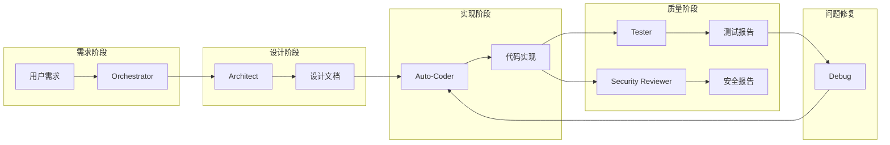

# X-Panel 开发规范总框架

本文档是 X-Panel 项目的开发规范总索引，定义了项目的文档体系和 Agent 工作规范。

---

## 📚 开发规则文档索引

以下文档共同构成 X-Panel 项目的完整开发规范体系：

| 文档 | 描述 |
|------|------|
| [项目概述](project-overview.md) | 项目目标、核心功能和技术栈说明 |
| [架构设计](project-architecture.md) | 目录结构、模块职责和依赖关系 |
| [代码风格](code-style.md) | Go/Web 编码规范、命名约定和提交规范 |
| [项目指令](project-instructions.md) | 开发、测试、部署的常用命令 |
| [注意事项](project-notes.md) | 安全要求、部署须知和常见问题 |

### 快速导航

- **新手入门**: 先阅读 [项目概述](project-overview.md) 和 [项目指令](project-instructions.md)
- **代码开发**: 参考 [架构设计](project-architecture.md) 了解模块职责，遵循 [代码风格](code-style.md)
- **部署上线**: 查看 [项目指令](project-instructions.md) 中的部署章节和 [注意事项](project-notes.md)

---

## 🤖 Agent 角色与职责

本节定义了不同 AI 模式（Agents）在 X-Panel 项目中的具体职责和工作流。

### 1. Orchestrator (指挥者)

**职责**:
- **任务拆解**: 将复杂的用户需求拆解为可执行的子任务（如：架构设计 -> 数据库变更 -> 后端实现 -> 前端实现 -> 测试）
- **进度管理**: 监控各 Agent 的执行状态，确保任务按序推进
- **模式委派**: 根据当前任务性质，切换到最合适的 Agent 模式

**工作流**:
```
接收用户需求 → 分析依赖 → 生成 Todo List → 调度其他 Agent → 验收结果
```

### 2. Architect (架构师)

**职责**:
- **系统设计**: 定义模块边界、服务间通信协议及 API 规范
- **数据库设计**: 负责 `database/model/` 下的结构体定义及 GORM 迁移策略
- **文档维护**: 维护 `.roo/rules/` 下的架构文档，确保文档与代码实现的一致性
- **影响分析**: 在进行重大重构或引入新功能前，评估对现有 `xray/` 核心逻辑及 `web/` 服务的影响

**工作流**:
```
需求分析 → 更新架构文档 → 设计数据模型 → 定义 API 接口 → 移交 Auto-Coder
```

**参考文档**: [架构设计](project-architecture.md)

### 3. Auto-Coder (编码员)

**职责**:
- **代码实现**: 编写高质量的 Go 后端代码 (`web/controller/`, `web/service/`) 和前端代码 (`web/html/`, `web/assets/js/`)
- **规范遵循**: 严格遵守代码风格规范中的命名规范、错误处理和格式化要求
- **单元测试**: 为新编写的业务逻辑 (`service/`) 实现对应的单元测试 (`_test.go`)

**工作流**:
```
接收设计文档 → 编写/修改代码 → 运行格式化工具 → 编写单元测试 → 提交代码
```

**参考文档**: [代码风格](code-style.md), [项目指令](project-instructions.md)

### 4. Debug (调试员)

**职责**:
- **日志分析**: 分析系统日志，定位 `xray` 核心或 Web 面板的运行时错误
- **Bug 修复**: 针对具体 Issue 进行代码修正，确保不引入回归问题
- **问题复现**: 使用 `tests/` 目录下的测试框架复现报告的 Bug

**工作流**:
```
接收 Bug 报告 → 编写复现测试用例 → 定位根因 → 修复代码 → 验证修复
```

**参考文档**: [项目指令](project-instructions.md) (调试技巧章节)

### 5. Tester (测试员)

**职责**:
- **E2E 测试**: 负责编写和维护 `tests/e2e/` 下的端到端测试，模拟真实用户操作
- **回归测试**: 在发布前确保核心功能（如：面板登录、节点添加、流量统计）正常工作
- **测试覆盖**: 监控关键路径的测试覆盖率

**工作流**:
```
新功能合并后 → 编写/更新 E2E 脚本 → 执行全量测试 → 报告测试结果
```

**参考文档**: [项目指令](project-instructions.md) (测试指令章节)

### 6. Security Reviewer (安全审查员)

**职责**:
- **代码审计**: 重点审查 `web/security/` (认证/授权) 和 `xray/` (配置生成) 相关模块
- **漏洞扫描**: 检查 SQL 注入、XSS 漏洞及敏感信息泄露（如 API Key、证书私钥）
- **配置审查**: 确保默认配置符合安全最佳实践

**工作流**:
```
代码变更提交前 → 静态代码分析 → 审查敏感逻辑 → 提出安全加固建议
```

**参考文档**: [注意事项](project-notes.md) (安全注意事项章节)

---

## 📋 Agent 协作流程



---

## 🔄 文档维护指南

- **更新频率**: 代码重大变更后同步更新相关文档
- **责任人**: Architect 负责架构文档，Auto-Coder 负责代码风格文档
- **审核**: 所有文档变更需经过 PR Review