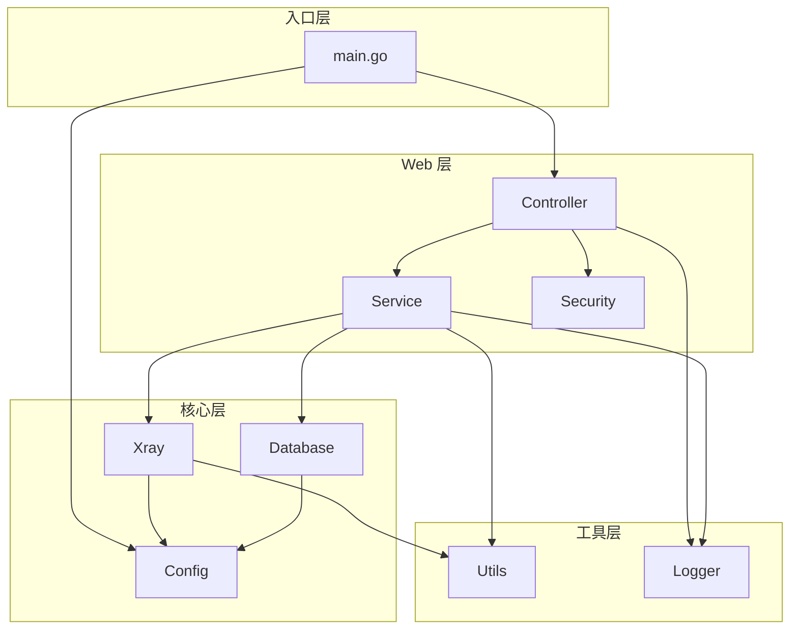

# 架构设计 (Project Architecture)

## 项目目录结构

```
X-Panel/
├── main.go              # 应用入口
├── config/              # 配置加载与管理
├── database/            # 数据库交互层
│   ├── model/           # 数据模型定义
│   └── db.go            # 数据库连接与迁移
├── web/                 # Web 服务层
│   ├── controller/      # 控制器 (HTTP 请求处理)
│   ├── service/         # 业务逻辑服务
│   ├── html/            # 前端模板与页面
│   ├── assets/          # 静态资源 (JS/CSS/图片)
│   └── security/        # 认证与授权模块
├── xray/                # Xray 核心集成
│   └── process.go       # Xray 进程管理
├── sub/                 # 订阅服务模块
├── sni/                 # SNI 选择模块
├── util/                # 通用工具函数
├── logger/              # 日志模块
├── tests/               # 测试代码
│   ├── e2e/             # 端到端测试
│   └── ...              # 单元测试
├── docs/                # 项目文档
├── build/               # 构建脚本
├── install.sh           # 一键安装脚本
└── x-ui.sh              # 管理菜单脚本
```

## 核心模块职责

### 1. Config 模块 (`config/`)

**职责**: 应用配置的加载、解析与管理

- 从环境变量和配置文件加载配置
- 提供配置项的类型安全访问
- 支持运行时配置热更新

### 2. Database 模块 (`database/`)

**职责**: 数据持久化与 ORM 操作

- **模型定义** (`model/`): 使用 GORM 结构体定义数据表
- **迁移管理**: 自动数据库结构迁移
- **CRUD 操作**: 统一的数据访问接口

**主要模型**:
- `User`: 管理员用户
- `Inbound`: 入站规则配置
- `Client`: 客户端信息
- `Setting`: 系统设置

### 3. Web 模块 (`web/`)

**职责**: HTTP 服务与业务处理

#### 3.1 Controller 层 (`controller/`)
- 处理 HTTP 请求/响应
- 参数验证与绑定
- 调用 Service 层执行业务逻辑
- 返回 JSON/HTML 响应

#### 3.2 Service 层 (`service/`)
- 核心业务逻辑实现
- 跨模块业务编排
- 数据处理与转换

#### 3.3 前端 (`html/`, `assets/`)
- HTML 模板渲染
- 静态资源服务
- 前后端数据交互

### 4. Xray 模块 (`xray/`)

**职责**: Xray 核心进程管理与配置生成

- Xray 进程启动/停止/重启
- 配置文件生成与验证
- 运行状态监控
- 流量统计收集

### 5. 订阅模块 (`sub/`)

**职责**: 订阅链接生成与格式转换

- 生成客户端订阅链接
- 支持多种订阅格式 (V2Ray, Clash, Surge 等)
- 订阅内容加密与编码

### 6. 安全模块 (`web/security/`)

**职责**: 认证、授权与安全防护

- 用户登录认证
- Session 管理
- 访问控制
- 安全配置验证

## 模块依赖关系



## 请求处理流程

```
HTTP Request
    │
    ▼
┌─────────────┐
│  Controller │  ← 请求路由 & 参数校验
└─────────────┘
    │
    ▼
┌─────────────┐
│   Service   │  ← 业务逻辑处理
└─────────────┘
    │
    ├───────────────┬───────────────┐
    ▼               ▼               ▼
┌─────────┐   ┌─────────┐   ┌─────────┐
│Database │   │  Xray   │   │  Utils  │
└─────────┘   └─────────┘   └─────────┘
    │               │
    ▼               ▼
  SQLite        Xray Core
```

## 数据流设计

### 入站规则创建流程
1. 用户通过 Web UI 提交入站配置
2. Controller 接收并验证表单数据
3. Service 层处理业务逻辑:
   - 生成唯一标识
   - 构建 Xray 配置片段
4. Database 持久化入站规则
5. Xray 模块重新加载配置
6. 返回操作结果给用户

### 流量统计流程
1. Xray 核心生成流量日志
2. 定时任务收集统计数据
3. Service 层解析并聚合数据
4. Database 更新流量记录
5. Web UI 展示统计图表
