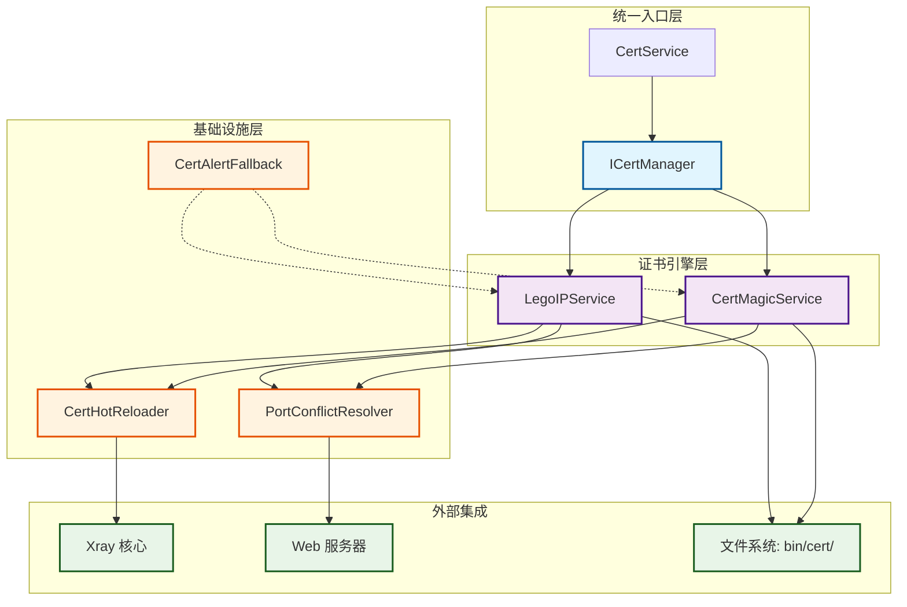

# Lego + CertMagic 证书管理架构设计

## 1. 概述 (Overview)

本架构设计基于 `docs/cert-management-spec.md` 规范，实现双引擎证书管理策略：

- **LegoIPService**: 使用 Lego 库专门处理 IP 证书申请
- **CertMagicService**: 使用 CertMagic 库专门处理域名证书自动化管理

新架构完全替换现有的 `acme.sh` 依赖，实现纯 Go 原生解决方案。

## 2. 系统架构图 (System Architecture)



### 架构说明

1. **统一入口层**: `CertService` 作为门面模式，提供统一的证书管理 API
2. **证书引擎层**: 双引擎并存，职责分离
3. **基础设施层**: 提供通用的证书管理基础设施
4. **外部集成**: 与 Xray 核心、Web 服务器的文件系统集成

## 3. 服务边界定义 (Service Boundaries)

### 3.1 LegoIPService (Lego IP 证书服务)

**职责范围**:
- IP 地址验证和格式检查
- Lego 库初始化和配置
- ACME HTTP-01 Challenge 执行
- IP 证书申请和续期
- 证书文件存储 (bin/cert/ip/{ip}/)
- 集成 PortConflictResolver 处理端口 80 占用

**不负责**:
- 域名证书管理
- 自动化续期监控 (仅手动触发)
- DNS Challenge 支持

### 3.2 CertMagicService (CertMagic 域名证书服务)

**职责范围**:
- 域名证书的全生命周期管理
- 自动化续期监控和执行
- 多 Challenge 支持 (HTTP-01, TLS-ALPN-01, DNS-01)
- 证书文件存储 (bin/cert/domains/)
- Cloudflare 等 DNS 提供商集成

**不负责**:
- IP 证书管理
- 端口冲突解决 (通过自定义 Solver 集成)

### 3.3 CertService (统一证书服务)

**职责范围**:
- 提供统一的证书管理接口
- 路由请求到相应的引擎服务
- 协调基础设施组件
- 管理证书状态查询

**协调逻辑**:
1. 根据请求类型 (IP vs Domain) 路由到对应引擎
2. 在证书操作前/后触发基础设施服务
3. 聚合多个引擎的状态信息

## 4. 接口设计 (Interface Design)

### 4.1 核心接口定义

```go
// ICertManager 统一证书管理接口
type ICertManager interface {
    // ListCerts 列出所有管理的证书信息
    ListCerts() ([]CertInfo, error)

    // GetCertPath 获取指定标识(IP或域名)的证书路径
    GetCertPath(identifier string) (certPath, keyPath string, err error)

    // ObtainCert 申请新证书 (根据类型自动路由)
    ObtainCert(identifier string, email string, options CertOptions) error

    // RenewCert 续期证书
    RenewCert(identifier string) error
}

// CertInfo 证书信息摘要
type CertInfo struct {
    Identifier string    // IP 地址或域名
    Type       CertType  // IP 或 Domain
    Provider   string    // "Let's Encrypt", "ZeroSSL", etc.
    Expiry     time.Time // 过期时间
    AutoRenew  bool      // 是否自动续期
    Status     CertStatus // 证书状态
}

// CertType 证书类型枚举
type CertType string

const (
    CertTypeIP     CertType = "IP"
    CertTypeDomain CertType = "Domain"
)

// CertStatus 证书状态枚举
type CertStatus string

const (
    CertStatusValid    CertStatus = "valid"
    CertStatusExpired  CertStatus = "expired"
    CertStatusRevoked  CertStatus = "revoked"
    CertStatusPending  CertStatus = "pending"
)

// CertOptions 证书申请选项
type CertOptions struct {
    ChallengeType string            // "http-01", "tls-alpn-01", "dns-01"
    DNSConfig     map[string]string // DNS 提供商配置
}

// ILegoIPService Lego IP 证书服务接口
type ILegoIPService interface {
    ICertManager // 嵌入基础接口

    // ObtainIPCert 申请 IP 证书
    ObtainIPCert(ctx context.Context, ip string, email string) error

    // RenewIPCert 续期 IP 证书
    RenewIPCert(ctx context.Context, ip string) error

    // ValidateIP 验证 IP 地址格式
    ValidateIP(ip string) error
}

// ICertMagicService CertMagic 域名服务接口
type ICertMagicService interface {
    ICertManager // 嵌入基础接口

    // ManageDomains 开始管理一组域名（自动申请/续期）
    ManageDomains(ctx context.Context, domains []string, email string, options CertOptions) error

    // UpdateDNSConfig 更新 DNS Challenge 配置
    UpdateDNSConfig(provider string, credentials map[string]string) error

    // StopDomainManagement 停止对域名的管理
    StopDomainManagement(domain string) error
}
```

### 4.2 基础设施接口

```go
// IPortResolver 端口冲突解决接口
type IPortResolver interface {
    // AcquirePort80 获取 80 端口控制权
    AcquirePort80(ctx context.Context) error

    // ReleasePort80 释放 80 端口控制权
    ReleasePort80() error
}

// ICertReloader 证书热重载接口
type ICertReloader interface {
    // OnCertUpdated 证书更新回调
    OnCertUpdated(certPath, keyPath string) error
}

// IAlertService 告警服务接口
type IAlertService interface {
    // SendAlert 发送告警消息
    SendAlert(title, message, level string) error
}
```

## 5. 文件结构设计 (File Structure)

```
web/service/
├── cert/                          # 新证书管理模块目录
│   ├── interfaces.go              # 接口定义
│   ├── cert_manager.go            # 统一证书管理器实现
│   ├── lego_service.go            # LegoIPService 实现
│   ├── certmagic_service.go       # CertMagicService 实现
│   ├── cert_storage.go            # 证书文件存储管理
│   ├── cert_validator.go          # 证书验证工具
│   └── types.go                   # 公共类型定义
├── cert_hot_reloader.go           # 现有文件 (无需修改)
├── port_conflict_resolver.go      # 现有文件 (无需修改)
└── cert_alert_fallback.go         # 现有文件 (无需修改)

bin/cert/                          # 证书存储目录
├── ip/                            # IP 证书存储
│   └── 1.2.3.4/
│       ├── 1.2.3.4.cer
│       └── 1.2.3.4.key
└── domains/                       # 域名证书存储 (CertMagic 默认结构)
    └── certificates/
        └── example.com/
            ├── example.com.crt
            └── example.com.key
```

### 文件职责说明

- `interfaces.go`: 定义所有公共接口
- `cert_manager.go`: 实现 ICertManager，提供统一入口
- `lego_service.go`: 实现 ILegoIPService，IP 证书管理
- `certmagic_service.go`: 实现 ICertMagicService，域名证书管理
- `cert_storage.go`: 处理证书文件的读写和权限设置
- `cert_validator.go`: 证书格式验证和过期检查
- `types.go`: 公共结构体和枚举定义

## 6. 依赖管理 (Dependency Management)

### 6.1 go.mod 更新

需要添加以下依赖：

```go
require (
    github.com/go-acme/lego/v4 v4.14.2
    github.com/caddyserver/certmagic v0.20.0
    // 其他现有依赖...
)
```

### 6.2 版本兼容性考虑

- **Lego v4**: 稳定版本，支持最新的 ACME 协议
- **CertMagic v0.20.0**: Caddy 2.x 兼容版本
- **Go 版本**: 需要 Go 1.19+ 以支持泛型和最新标准库

### 6.3 安全更新策略

- 定期检查上游安全更新
- 使用 dependabot 或类似工具监控依赖
- 在发布前进行安全审计

## 7. 迁移策略 (Migration Strategy)

### 7.1 从 acme.sh 到 Lego 的迁移步骤

#### Phase 1: 并存期 (1-2 周)
1. **实现新架构**: 完成 LegoIPService 和 CertMagicService
2. **保持兼容**: acme.sh 服务继续可用
3. **A/B 测试**: 新旧服务并存，逐步迁移用户

#### Phase 2: 迁移期 (2-4 周)
1. **数据迁移**: 将现有 acme.sh 证书复制到新目录结构
2. **配置迁移**: 更新数据库中的证书路径配置
3. **功能验证**: 验证新服务的所有功能正常

#### Phase 3: 切换期 (1 周)
1. **切换默认**: 将新架构设为默认证书服务
2. **清理旧代码**: 移除 acme.sh 相关代码
3. **监控验证**: 观察生产环境稳定性

### 7.2 向后兼容性保障

#### 配置文件兼容
- 保留现有的证书路径配置
- 提供自动检测和迁移脚本

#### API 兼容
- 保持现有 CertService 接口不变
- 新功能通过扩展接口提供

#### 数据兼容
- 支持读取旧格式证书
- 自动转换到新存储格式

### 7.3 回滚策略

#### 快速回滚
1. **配置切换**: 通过配置开关回滚到 acme.sh
2. **备份恢复**: 从备份恢复旧证书文件
3. **服务重启**: 重启面板服务激活旧配置

#### 渐进回滚
1. **分批回滚**: 按用户或服务器分组回滚
2. **监控指标**: 建立回滚成功率监控
3. **问题排查**: 详细记录回滚原因和解决方案

## 8. 实施计划 (Implementation Plan)

### 8.1 第一阶段：核心架构 (Week 1-2)
- [ ] 实现基础接口和类型定义
- [ ] 完成 LegoIPService 核心功能
- [ ] 实现证书存储管理
- [ ] 集成 PortConflictResolver

### 8.2 第二阶段：CertMagic 集成 (Week 3-4)
- [ ] 实现 CertMagicService
- [ ] DNS Challenge 支持
- [ ] 域名证书自动化续期

### 8.3 第三阶段：统一管理 (Week 5-6)
- [ ] 实现 CertManager 统一接口
- [ ] 集成 CertHotReloader
- [ ] 完成 CertAlertFallback 集成

### 8.4 第四阶段：测试和迁移 (Week 7-8)
- [ ] 编写全面的单元测试
- [ ] 集成测试和端到端测试
- [ ] 生产环境迁移和验证

## 9. 风险评估 (Risk Assessment)

### 9.1 技术风险

#### Lego 库稳定性
- **风险**: Lego 库可能存在 bug 或兼容性问题
- **缓解**: 全面测试，准备回滚方案

#### CertMagic 配置复杂性
- **风险**: CertMagic 配置复杂，容易出错
- **缓解**: 分阶段实现，充分测试每个 Challenge 类型

### 9.2 业务风险

#### 证书申请失败
- **风险**: 迁移过程中证书申请失败导致服务中断
- **缓解**: 保持 acme.sh 作为备选方案

#### Xray 集成问题
- **风险**: 证书热重载失败影响 Xray 服务
- **缓解**: 完善错误处理和告警机制

### 9.3 运维风险

#### 性能影响
- **风险**: 新架构增加内存和 CPU 消耗
- **缓解**: 性能测试和资源监控

#### 监控缺失
- **风险**: 新架构缺乏监控指标
- **缓解**: 建立完整的监控体系

## 10. 总结 (Summary)

本架构设计实现了从 acme.sh 到纯 Go 原生证书管理的平滑迁移：

- **模块化**: 双引擎分离，职责清晰
- **可扩展**: 支持多种 Challenge 类型和 DNS 提供商
- **可维护**: 遵循 Clean Architecture 原则
- **向后兼容**: 保障现有功能不受影响

新架构预计提升证书管理的可靠性和自动化水平，同时降低对外部 Shell 脚本的依赖。