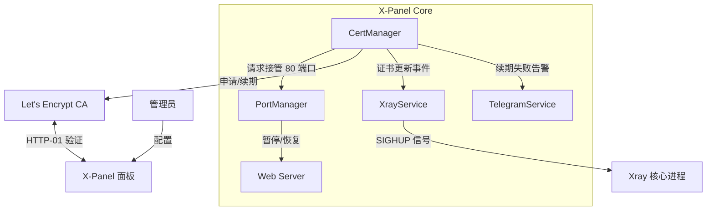
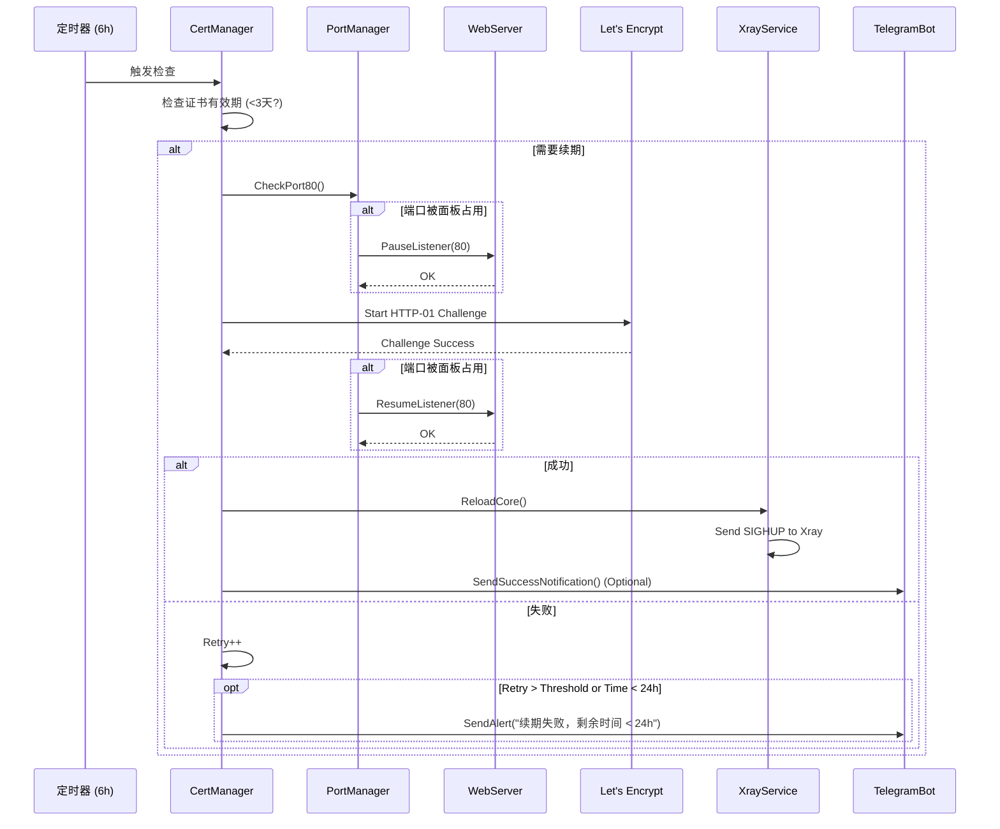

# X-Panel IP 证书功能深度改进架构设计

## 1. 架构概览

本设计旨在增强 X-Panel 的 IP 证书管理功能，解决端口冲突、续期不及时、服务重启中断连接以及缺乏告警等痛点。

核心改进包括引入 **PortManager** 进行端口 80 的智能接管，定制 **CertMagic** 配置以适应 6 天短寿命证书，实现 **Xray Hot Reload** 机制，以及集成 **Telegram Bot** 进行异常告警。

### 1.1 系统上下文图 (Mermaid)



---

## 2. 核心组件设计

### 2.1 端口冲突自愈 (Port Conflict Self-Healing)

**问题**: `certmagic` 的 HTTP-01 挑战需要绑定 80 端口。如果 X-Panel 自身或 Nginx 占用了 80 端口，申请将失败。

**解决方案**: 引入 `PortManager` 组件，负责协调 80 端口的使用权。

- **检测逻辑**: 在申请证书前，尝试 `net.Dial("tcp", ":80")`。
- **接管逻辑**:
  - 如果 80 端口被 X-Panel 自身占用（通过检查配置或内存中的 Listener），`PortManager` 通知 `WebServer` 暂停 80 端口的 Listener。
  - `CertManager` 启动 `certmagic` 进行验证。
  - 验证完成后，`CertManager` 通知 `PortManager` 释放端口。
  - `PortManager` 通知 `WebServer` 恢复 Listener。
- **外部占用**: 如果是被 Nginx 等外部进程占用，目前仅记录日志并尝试通过 WebHook 或提示用户手动处理（自动杀进程风险过大）。

### 2.2 激进续期策略 (Aggressive Renewal)

**问题**: IP 证书有效期仅 6 天。默认的 30 天续期窗口不适用。

**解决方案**: 定制 `certmagic.Config`。

- **CheckInterval**: 调整为 **6 小时** (原为 24 小时)。
- **RenewThreshold**: 调整为 **3 天** (即有效期剩余 < 50% 时即续期)。
- **RetryPolicy**: 指数退避策略，最大重试 12 次，确保在 3 天的缓冲期内有足够机会成功。

### 2.3 Xray 热加载 (Hot Reload)

**问题**: 证书更新后，重启 Xray 服务会导致所有现有连接断开。

**解决方案**: 利用 Xray 的配置重载能力。

- **机制**: `XrayService` 监听证书更新事件。
- **动作**: 当收到事件时，向 Xray 进程发送 `syscall.SIGHUP` 信号，或调用 Xray API (如果支持) 触发配置重载。
- **实现**: 在 `XrayService` 中增加 `ReloadCore()` 方法。

### 2.4 异常告警与回退 (Alerting & Fallback)

**问题**: 证书过期导致服务不可用，管理员无感知。

**解决方案**: 集成 `TelegramService`。

- **告警触发**:
  - 续期连续失败超过 5 次。
  - 证书剩余有效期小于 24 小时。
- **回退机制**:
  - 当证书彻底过期时，自动生成自签名证书替换，或切换 Inbound 配置回退到 HTTP/REALITY 模式（需配置允许）。
  - _本期设计优先实现自签名证书回退，以保证服务不彻底中断。_

---

## 3. 交互流程设计

### 3.1 证书申请/续期流程



---

## 4. 接口定义 (Golang)

### 4.1 PortManager 接口

```go
package service

// PortManager 定义端口管理行为
type PortManager interface {
    // IsPortOccupied 检查端口是否被占用
    IsPortOccupied(port int) bool

    // IsPanelOccupied 检查是否是面板自己占用了端口
    IsPanelOccupied(port int) bool

    // RequestTakeover 请求临时接管端口
    // callback: 在接管期间执行的函数
    RequestTakeover(port int, callback func() error) error
}
```

### 4.2 CertService 扩展

```go
type CertConfig struct {
    IP             string
    Email          string
    RenewThreshold time.Duration // 默认 3天
    CheckInterval  time.Duration // 默认 6小时
}

type CertService struct {
    // ... existing fields
    portMgr     PortManager
    xrayService *XrayService
    tgBot       TelegramService
}

// ReloadXray 触发 Xray 重载
func (s *CertService) ReloadXray() error {
    return s.xrayService.ReloadCore()
}
```

### 4.3 XrayService 扩展

```go
// ReloadCore 发送信号给 Xray 进程以重载配置/证书
func (s *XrayService) ReloadCore() error {
    if s.process == nil {
        return errors.New("xray process not running")
    }
    // 发送 SIGHUP 信号
    return s.process.Signal(syscall.SIGHUP)
}
```

---

## 5. 数据流与状态管理

### 5.1 证书状态机

- **State: Valid**: 证书有效，剩余时间 > 3天。
- **State: Renewing**: 正在进行续期流程。
- **State: Failed**: 续期失败，进入重试队列。
- **State: Critical**: 剩余时间 < 1天，触发高频告警。
- **State: Expired**: 证书已过期，触发回退逻辑。

### 5.2 配置存储

在 `config.json` 或数据库中增加 IP 证书专用配置：

```json
{
  "ip_cert": {
    "enabled": true,
    "ip": "1.2.3.4",
    "email": "admin@example.com",
    "auto_renew": true,
    "renew_threshold_days": 3,
    "fallback_action": "self_signed" // or "none"
  }
}
```

---

## 6. 错误处理策略

| 错误场景           | 处理动作                      | 告警级别                     |
| :----------------- | :---------------------------- | :--------------------------- |
| 端口 80 被外部占用 | 记录日志，跳过本次续期        | Warning (如果剩余时间 < 2天) |
| 端口 80 接管失败   | 放弃接管，尝试直接申请        | Warning                      |
| 网络验证超时       | 指数退避重试 (1m, 5m, 15m...) | Info                         |
| 续期连续失败 > 5次 | 记录错误日志                  | Warning                      |
| 剩余有效期 < 24h   | 每 6h 尝试一次                | **Critical (TG Bot 推送)**   |
| Xray 重载失败      | 尝试完全重启 Xray             | Error                        |

## 7. 兼容性说明

- **现有功能**: 不影响域名证书的申请逻辑。IP 证书逻辑独立封装。
- **操作系统**: 端口检测和信号发送主要适配 Linux 环境。Windows 环境下 `syscall.SIGHUP` 可能不支持，需降级为 `Restart`。
- **Web Server**: 需确保 `Gin` 引擎的 Listener 可以被优雅关闭和重启 (Graceful Shutdown & Restart)。
