# SNI 域名不重复选择架构设计 (Architecture Design)

## 1. 架构概述

SNI 域名不重复功能是一个轮询式选择器，确保在生成 Reality/TLS 节点时，连续创建的节点使用不同的 SNI 域名。该设计遵循整洁架构原则，具有良好的模块化、可测试性和可维护性。

## 2. 组件架构

### 2.1 组件定位

**文件位置**: `web/service/sni_selector.go`

选择将 `SNISelector` 放置在 `web/service` 包下的原因：

1. **功能相关性**: 与 `Tgbot` 服务的功能紧密相关，主要服务于 TG Bot 的"一键配置"功能
2. **依赖关系**: 需要访问 `ServerService` 获取地理位置相关的 SNI 列表
3. **复用性**: 独立文件设计便于后续其他服务（如 Web API）复用
4. **依赖管理**: 可以直接使用项目中的通用工具（如 `util/common`）

### 2.2 组件图 (Component Diagram)


## 3. 数据流设计

### 3.1 初始化流程


### 3.2 一键配置使用流程

```mermaid
sequenceDiagram
    participant U as User
    participant T as Tgbot
    participant R as SNISelector
    participant I as InboundService
    
    U->>T: /oneclick 命令
    T->>T: sendOneClickOptions()
    U->>T: 选择配置类型
    T->>R: Next() (获取 SNI)
    R-->>T: string (下一个域名)
    T->>T: buildRealityInbound(randomDest)
    T->>I: AddInbound(newInbound)
    I-->>T: (*model.Inbound, error)
    T->>T: SendOneClickConfig()
    T->>U: 发送配置消息
```



## 4. 并发模型

### 4.1 锁策略

**选择**: 使用 `sync.Mutex` 而非 `sync.RWMutex`

**原因**:
1. **操作简单**: `Next()` 方法执行时间极短（纳秒级），读多写少不显著
2. **避免饥饿**: 防止读写锁导致的写操作饥饿
3. **代码简洁**: 减少锁的复杂度

### 4.2 并发安全性

```go
func (s *SNISelector) Next() string {
    s.mu.Lock()           // 互斥锁保证原子性
    defer s.mu.Unlock()
    
    // 临界区操作
    if s.index >= len(s.domains) {
        s.index = 0
        s.shuffle()       // 可能较慢的操作也在锁保护下
    }
    
    domain := s.domains[s.index]
    s.index++
    return domain
}
```

### 4.3 性能考虑

1. **锁粒度**: 最小化临界区，只保护必要的操作
2. **预分配**: 避免在锁内进行内存分配
3. **快速返回**: 空列表检查在锁外进行

## 5. 可测试性设计

### 5.1 依赖注入

```go
// 构造函数支持自定义随机源
func NewSNISelectorWithRand(initialDomains []string, rng *rand.Rand) *SNISelector {
    s := &SNISelector{
        domains: make([]string, len(initialDomains)),
        index:   0,
        rng:     rng,
    }
    copy(s.domains, initialDomains)
    s.shuffle()
    return s
}
```

### 5.2 Mock 支持

```go
// 测试友好的接口定义
type SNISelectorInterface interface {
    Next() string
    UpdateDomains(newDomains []string)
    GetCurrentDomain() string
}

// 便于使用 Mock 进行集成测试
type MockSNISelector struct {
    domains []string
    calls   int
}

func (m *MockSNISelector) Next() string {
    m.calls++
    if len(m.domains) == 0 {
        return ""
    }
    return m.domains[m.calls%len(m.domains)]
}
```

### 5.3 测试场景覆盖

1. **基本轮询**: 验证域名轮询逻辑
2. **边界条件**: 空列表、单个域名
3. **并发安全**: 多 goroutine 同时调用
4. **洗牌验证**: 确保每轮开始时重新洗牌
5. **集成测试**: 与 Tgbot 的完整流程测试

## 6. 错误处理与回退机制

### 6.1 空列表处理

```go
func (s *SNISelector) Next() string {
    // 快速检查，避免锁竞争
    if len(s.domains) == 0 {
        return "" // 或者返回默认域名
    }
    
    s.mu.Lock()
    defer s.mu.Unlock()
    
    // ... 其余逻辑
}
```

### 6.2 优雅降级

如果 `SNISelector` 初始化失败或出现异常：

1. **回退到随机选择**: Tgbot 检测到 `sniSelector == nil` 时使用原有随机逻辑
2. **日志记录**: 详细记录错误信息，便于问题排查
3. **用户提示**: 在必要时向用户提示功能异常

## 7. 监控与指标

### 7.1 关键指标

1. **选择次数**: `SNISelector.Next()` 调用频率
2. **洗牌次数**: 每轮洗牌执行次数
3. **域名分布**: 各域名被选中的频率统计
4. **错误率**: 选择失败的次数

### 7.2 日志策略

```go
// 在关键操作点添加日志
func (s *SNISelector) Next() string {
    // ... 锁保护逻辑
    if s.index >= len(s.domains) {
        s.index = 0
        s.shuffle()
        logger.Infof("SNI selector reshuffled, starting new round with %d domains", len(s.domains))
    }
    
    domain := s.domains[s.index]
    s.index++
    
    logger.Debugf("SNI selector selected domain: %s (index: %d)", domain, s.index-1)
    return domain
}
```

## 8. 配置管理

### 8.1 运行时更新

```go
// 支持运行时更新域名列表
func (s *SNISelector) UpdateDomains(newDomains []string) {
    if len(newDomains) == 0 {
        return // 忽略空更新
    }
    
    s.mu.Lock()
    defer s.mu.Unlock()
    
    s.domains = make([]string, len(newDomains))
    copy(s.domains, newDomains)
    s.index = 0 // 重置索引
    s.shuffle() // 重新洗牌
    
    logger.Infof("SNI selector updated with %d domains", len(newDomains))
}
```

### 8.2 配置验证

```go
func validateDomains(domains []string) error {
    if len(domains) == 0 {
        return errors.New("domain list cannot be empty")
    }
    
    seen := make(map[string]bool)
    for _, domain := range domains {
        if strings.TrimSpace(domain) == "" {
            return errors.New("domain cannot be empty")
        }
        if seen[domain] {
            return errors.New("duplicate domain found: " + domain)
        }
        seen[domain] = true
    }
    
    return nil
}
```

## 9. 总结

### 9.1 架构优势

1. **模块化设计**: 独立组件，便于维护和测试
2. **并发安全**: 使用 Mutex 确保线程安全
3. **可测试性**: 支持依赖注入和 Mock 测试
4. **可扩展性**: 支持运行时配置更新
5. **性能优化**: 最小化锁粒度，快速操作

### 9.2 实施建议

1. **分阶段部署**: 先在测试环境验证，再逐步推广
2. **监控到位**: 添加详细的监控指标和日志
3. **回退机制**: 保留原有的随机选择逻辑作为备选
4. **文档完善**: 及时更新相关文档和使用说明

### 9.3 风险评估

1. **性能影响**: 锁机制可能带来微小的性能开销，但影响可忽略
2. **复杂度**: 增加了一定的代码复杂度，但提高了可维护性
3. **依赖关系**: 与现有服务有耦合，但接口清晰

该架构设计确保了 SNI 域名不重复功能的高效、可靠实现，同时保持了良好的可维护性和可扩展性。